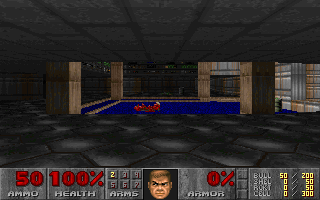

# doom-flow

[](https://github.com/godofecht/doom-flow/actions/workflows/record-gif.yml)
[](https://github.com/godofecht/doom-flow/actions/workflows/pages.yml)

**Play in the browser:** [godofecht.github.io/doom-flow](https://godofecht.github.io/doom-flow/)
(Flow → WebAssembly — Play, Watch AI, or RL Arena)

Doom, ported to the [Flow](https://github.com/flooooooooooow/flow) programming
language. Started from the doomgeneric C core (same spirit as
[doom-zig](https://github.com/3x3xX3N0N/doom-zig)); the engine is now Flow.



Public CI records that GIF with Flow's headless gfx-record path
(`FLOW_GFX_RECORD_*` + `frames_to_gif.py`) — same pipeline as `flow record`.

Sister project: [doom-flow-rl](https://github.com/godofecht/doom-flow-rl)
trains a Flow agent on a headless Doom-like arena with `stdlib/ai.flow`
Q-learning.

## Status

The full engine is Flow (`*.flow` at the repo root). Host ABI that Flow
cannot express yet (calling through opaque C function pointers, `errno`,
macOS error popup) goes through Flow's always-linked runtime
(`flow_rt_support.c` / `docs/language/c-fnptr-call.md`). Doom wraps those
as `platform.flow`.

`doomgeneric/` keeps the original LICENSE only.

## Build and run

Requires the Flow repo at `~/flow` (sibling `../flow`, or edit
[`flow.toml`](flow.toml) `[native].sources`), Python 3, clang, and macOS
for the interactive window. The shareware `doom1.wad` / `DOOM1.WAD` is
included.

```bash
~/flow/flow build-native
./build/doom
```

## Play on the web

```bash
FLOW_DIR=~/flow ./scripts/build_wasm.sh
python3 -m http.server 8000 --directory site
# open http://127.0.0.1:8000/
```

GitHub Pages serves the same `site/` tree. Modes: **Play**, **Watch AI**
(`DOOMFLOW_AI` pilot in the full engine), and **RL Arena** (Q-learning viz
from the sister trainer).


```bash
FLOW_DIR=~/flow ./scripts/record_gif.sh
# optional: --frames 180 --out media/doom.gif --args "-timedemo demo1"
```

## Controls

Arrows or WASD to move, X or F to fire, Space or E to use, 1-7 weapons,
Tab automap, Esc menu. The macOS gfx backend does not deliver modifier
keys, which is why fire lives on X.

## Testing

```bash
DOOMFLOW_ARGS="-timedemo demo1" ./build/doom
```

plays a recorded demo deterministically through the whole engine and must
report `timed 5026 gametics`.

`DOOMFLOW_KEYSCRIPT="120:9:1,125:9:0"` injects scripted key events
(frame:doomkey:updown) for automated UI checks.

See `PORTING.md` for the porting method and Flow-specific details.
